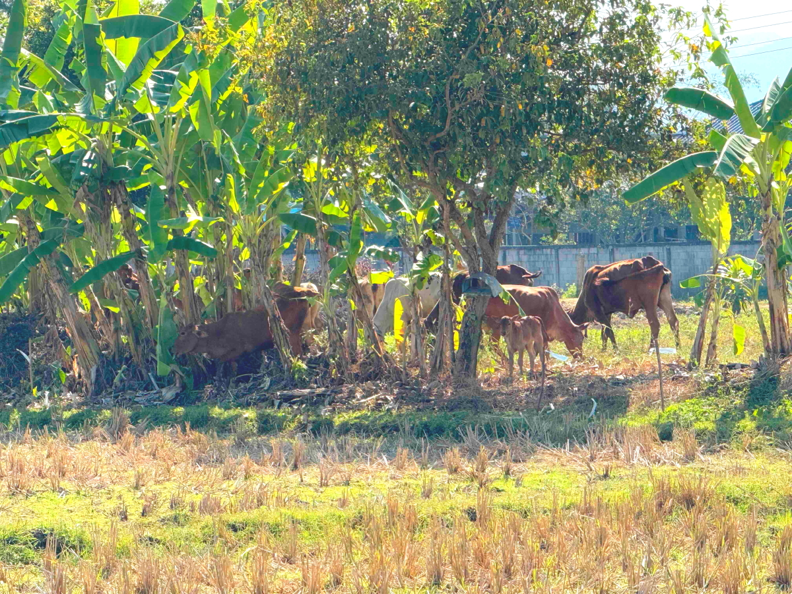

# 20250115_chiangrai

<html>
<head>

<meta charset="UTF-8">
<meta http-equiv="Content-Type" content="text/html; charset=UTF-8">
<meta http-equiv="X-UA-Compatible" content="IE=EmulateIE10" />
<meta http-equiv="X-UA-Compatible" content="IE=edge">

<!--ここから上はお決まりの定型文です-->

<!--ここからが表現の書式などを決めるcssという部分-->

<link href="https://cdnjs.cloudflare.com/ajax/libs/lightbox2/2.7.1/css/lightbox.css" rel="stylesheet">

</head>

<body>

モバイル端末をお使いの場合は、画面を横向きにすると
より見やすくご覧頂けます。

<!--ここ上は、ほぼそのまま使います！-->

<!--QRコードの挿入例-->

 アクセス用QRコード

<marquee direction="left" scrollamount="20" width="30%">(^_^)/~alis</marquee>

<!--流れ文字の挿入例-->
<h1><marquee behavior="left">!!! 2025/01/15、2日連続の手作り料理、その後は足湯でまったり〜!!!</marquee></h1>

                          

<!--ここから下が、本体部分-->

<h2>朝は庭のお花を眺めてましたが、 昨日に引き続き知り合いのお宅でお昼をいただきました</h2>

<h2>2日連続でこちらのお宅にお邪魔します</h2>

<h2>ちなみにカレンダーが2種類飾られてました 1枚目はチェンライ県知事カレンダー</h2>

<h2>2枚目は王室カレンダー</h2>

<h2>裏手の牛さんたちは今日も元気に草を啄みます</h2>

<h2>遠くの丘の上には何やらお寺のようなものが見えました</h2>

<h2>昨日のマンゴーはこの木から取ったものです</h2>

<h2>残りの実ももう少し色づけば食べられます</h2>

<h2>裏手の様子をよく見たら、椰子の木陰に牛さんたちがたくさんいます</h2>

<h2>放牧中の牛達を牛舎に戻すところでした</h2>

<h2>椰子の木のそばに牛舎があるようです</h2>

<h2>足元のお花を撮っていたら、ミツバチが参入</h2>

<h2>お昼の後は、先日のパートゥン温泉で足湯に浸かります</h2>

<h2>まずはお買い物</h2>

<h2>Rrサスが完全にボトムしちゃってます</h2>

<h2>足湯に浸かる前に広場を散策</h2>

<h2>市場スペースは平日は閉鎖中</h2>

<h2>常設の売店も半開き状態</h2>

<h2>先ほどのRrサスが沈んだ車はおばあちゃんから孫までが乗る自家用車でした この辺りの事情が日本との違いかも？！</h2>

<h2>噴水の虹は今日も綺麗でした</h2>

<h2>足湯は半分が休止中</h2>

<h2>残りの部分は盛況でした</h2>

<h2>宝くじはおじさんにバトンタッチしてました</h2>

<h2>子供達は服のままで足湯にどっぷり浸かってます お姉ちゃんは泳ぎの練習</h2>

<h2>足湯の後はいつものLotusですが、夕焼けグラデーションが綺麗！</h2>

<h2>ママ達がお買い物中はTVの前で待ちますが、 同じ状況の子が集まりました</h2>

<h2>日が暮れると惑星達が夜空を賑やかにしてます 金星と土星がランデブー、すぐ上には魚座の頭の部分</h2>

<h2>南の空には冬の星座達と冬の大三角形に木星と火星が加わって超大三角形！</h2>

   
<h2>以上、今回も取り留めのない画像集でしたが、ここまで観ていただきありがとうございました。</h2>

     
<h2>
<a href="https://torokoid.github.io/20241126_chiangrai/" target="_blank">Back to the menu page</a>
</h2>

   

         

  

      

<!--本体はここまで-->

<!--画面に空白地帯を作って、背景が見えるようにしています-->
                                              

<!-- フッタ -->
<footer>

Copyright 2025/01/16 alis @ChiangRai

</footer>

<!--HPにさまざまなJavaScriptを呼び込むための書式-->

